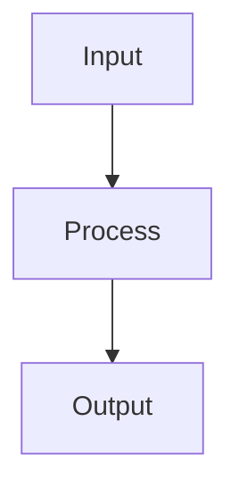

# README Generation Rules

When creating a README.md file for a project, follow this comprehensive format and structure.

## Required Sections

### 1. Header with Logo and Title
- Include project logo if available: ``
- Project title as main heading
- Badge section with relevant shields - include all applicable badges:
  - **Language/Version**: ``
  - **Package Management**: ``
  - **Build Status**: ``
  - **Coverage**: ``
  - **Pipeline Status**: ``

#### Badge Customization
- Update badge colors based on actual status:
  - `passed` → `brightgreen`
  - `failing` → `red`
  - `pending` → `yellow`
  - `unknown` → `lightgrey`
- Update version numbers to match your project
- Only include badges relevant to your project
- Keep badges on one line for clean appearance
- Order badges by importance: language → tools → status → license

### 2. Project Tagline
- One-line description in blockquote format explaining what the project does
- Should be clear, concise, and highlight the main value proposition

### 3. Table of Contents
- Use emoji icons for visual appeal (, , , , , , , , , )
- Link to all major sections
- Keep alphabetical or logical flow

### 4. Getting Started ()
- **Prerequisites**: List all requirements with version numbers
- **Installation**: Step-by-step instructions with code blocks
- Include multiple installation methods if applicable (e.g., make targets, manual setup)
- Mention environment setup tools (direnv, virtualenv, poetry)

### 5. Usage ()
- Clear examples for main use cases
- Command-line syntax with all options explained
- Both basic and advanced examples
- Show output format when relevant

### 6. Configuration ()
- Explain configuration system architecture
- Show directory structure for configs
- Provide examples of configuration files
- Document how to add new configurations

### 7. Testing ()
- Test data location and structure
- Commands to run tests (with coverage, specific modules)
- Make targets for common test scenarios
- Test data organization

### 8. Contributing ()
- Basic contribution guidelines
- Link to detailed contributing guide if available

## Formatting Guidelines

### Code Blocks
```bash
# Use bash syntax highlighting for shell commands
make setup
```

```python
# Use python syntax highlighting for Python code
from module import Class
```

### Command Options
Format command-line options clearly:
- **Required Options:**
  - `-f, --flag <value>`: Description
- **Optional Options:**
  - `--option <value>`: Description (default: value)

### Visual Elements

#### Workflow Diagrams
Use Mermaid diagrams for complex workflows:


#### Directory Trees
```
project/
├── src/
│   ├── module1/
│   └── module2/
├── tests/
└── docs/
```

### Tables
Use tables for structured information:
| Feature | Description | Status |
|---------|-------------|--------|
| Feature1 | Description |  |
| Feature2 | Description |  |

## Best Practices

### 1. Progressive Disclosure
- Start with simple examples
- Progress to advanced usage
- Hide complex details in linked documentation

### 2. Real Examples
- Use actual file paths from the project
- Show real command outputs
- Include common use cases

### 3. Version Compatibility
- Clearly state version requirements
- Note any breaking changes
- Include upgrade guides when needed

### 4. Cross-References
- Link to related documentation
- Reference configuration files
- Point to test examples

### 5. Maintenance
- Keep examples up-to-date
- Document new features promptly
- Remove deprecated content

## Special Sections (When Applicable)

### Workflow Section
- Use Mermaid diagrams to visualize process flow
- Explain each phase clearly
- Show inputs and outputs

### Vendor Dependencies
- Document external dependencies
- Provide setup instructions
- Link to detailed vendor documentation

### Input/Output Files
- Explain file formats
- Show example content
- Document naming conventions

### Performance Considerations
- Threading options
- Batch processing
- Resource requirements

## Style Guide

1. **Headers**: Use proper hierarchy (# ## ###)
2. **Emphasis**: Bold for important terms, italics for notes
3. **Lists**: Use bullets for unordered, numbers for steps
4. **Links**: Descriptive link text, avoid "click here"
5. **Line Length**: Keep under 120 characters when possible
6. **Spacing**: Blank lines between sections

## Example Structure Template

```markdown


# Project Name


> One-line project description

## Table of Contents
- [ Getting Started](#-getting-started)
- [ Usage](#-usage)
[...]

---

##  Getting Started

### Prerequisites
- Python 3.11+
- Other requirements

[Continue with other sections...]
```

## Remember
- READMEs are often the first interaction with your project
- Make them comprehensive but scannable
- Use visual elements to break up text
- Keep code examples executable
- Update regularly as project evolves
